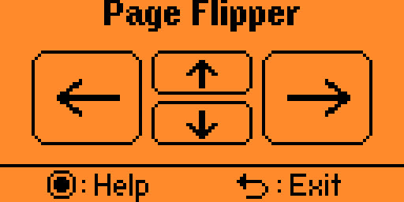
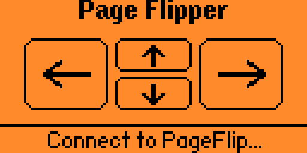
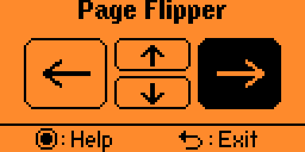
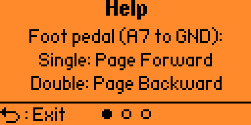

# Page Flipper for Flipper Zero

Page Flipper is a Bluetooth remote control application for the Flipper Zero. It emulates a HID (Human Interface Device) keyboard, allowing you to control presentations, e-readers (like Kindle or tablet apps), or media players using external foot pedals or the device's own keypad.



## Features

- **Bluetooth HID Keyboard:** Advertises as "PageFlip" for easy pairing.
- **Foot Pedal Support:** Support for one or two external switches connected via GPIO.
- **Visual Feedback:** Large, clear on-screen indicators that flash when a key is sent.
- **Keypad Control:** Use the Flipper Zero's physical buttons for manual control.
- **Help System:** Built-in multi-page instructions.

## Usage

### Connecting
When you launch the app, it will begin advertising via Bluetooth. Open the Bluetooth settings on your host device (Tablet, Laptop, or Phone) and pair with **PageFlip**.



The status line at the bottom will transition from "Connect to PageFlip..." to the help/exit instructions once a connection is established.

### Controls
The main screen displays four arrow keys. When an event is triggered (via pedal or keypad), the corresponding icon will flash inverted for 200ms.



- **OK:** Opens the Help screens.
- **Back (Short Press):** Exits the application.

## Hardware Connection

The application is designed to work with momentary switches (foot pedals) connected to the GPIO pins on top of the Flipper Zero.

**Crucial:** The switches must connect the GPIO pin directly to **GND**.

### Primary Pedal (A7)
Connect your main foot pedal between **Pin A7** and any **GND** pin.
- **Single Click:** Sends **Right Arrow** (Page Forward).
- **Double Click:** Sends **Left Arrow** (Page Backward).

### Optional Secondary Pedal (A6)
You can optionally connect a second pedal between **Pin A6** and **GND**.
- **Single Click:** Sends **Left Arrow** (Page Backward).
- **Double Click:** Sends **Home** key (returns to the First Page/Start).

## Help Screens
Press the **OK** button at any time to access the built-in help pages, which provide a quick reference for the pedal and keypad mappings.



## Installation

### Prerequisites
- A Flipper Zero with custom firmware support.
- `ufbt` (Universal Flipper Build Tool) installed on your computer.

### Build and Launch
1. Clone this repository into your `applications_user` folder or a standalone directory.
2. Connect your Flipper Zero via USB.
3. Run the following command:
   ```bash
   ufbt launch
   ```
